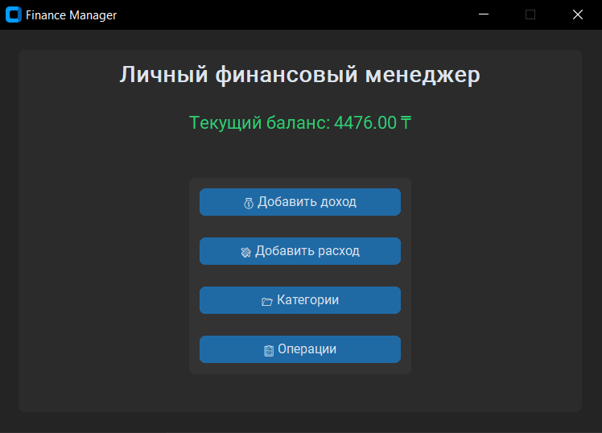
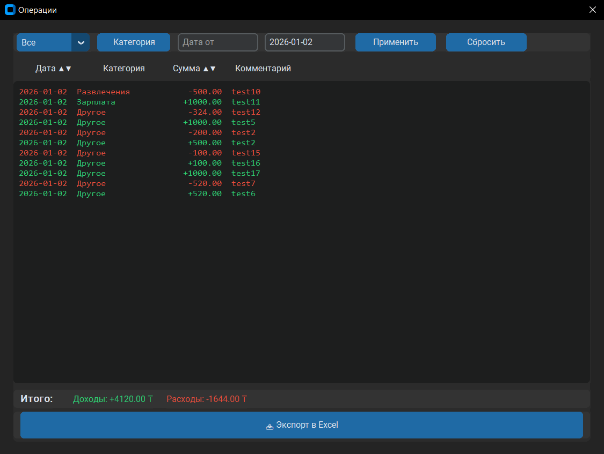
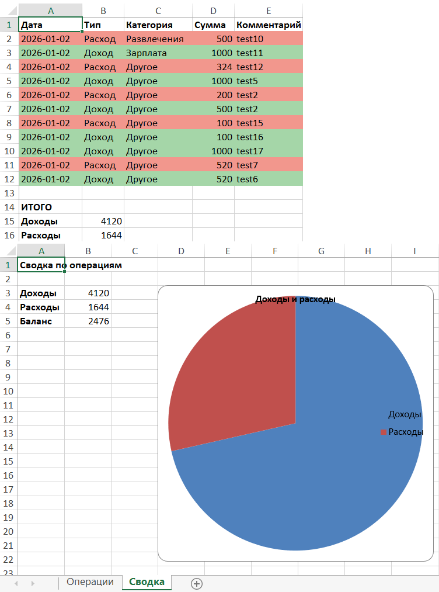

# 💰 Finance Manager (Python Desktop App)

A desktop application for personal finance tracking  
(income and expenses) with Excel export and analytics.

---

## 🚀 Features

- Add income and expense transactions
- Categories management (create, delete, filter)
- Filters by:
  - transaction type
  - category
  - date range
- Sorting:
  - by date
  - by amount (with expense priority)
- Totals:
  - total income
  - total expenses
- Excel export:
  - color-coded rows (income / expense)
  - totals section
  - separate **“Summary”** sheet
  - income vs expense chart

---

## 🖥️ Interface

The application is built using **CustomTkinter**  
and looks like a modern desktop application.

### Main window


### Transactions


### Excel export


---

## 🛠️ Technologies

- Python 3.11
- customtkinter
- SQLite
- openpyxl

---

## 📦 Installation and Run

```bash
git clone https://github.com/USERNAME/Finance-Manager-Python-Desktop-App-.git
cd finance-manager
pip install -r requirements.txt
python main.py
```
---

## 📊 Excel Report
```bash
The exported Excel file includes:

- “Transactions” sheet — all operations

- “Summary” sheet — income, expenses, balance

- Pie chart (income vs expenses)
```
---
## 👤 Author
```bash
This project was developed for educational and practical purposes
as a demonstration of a Python desktop application.
```
---